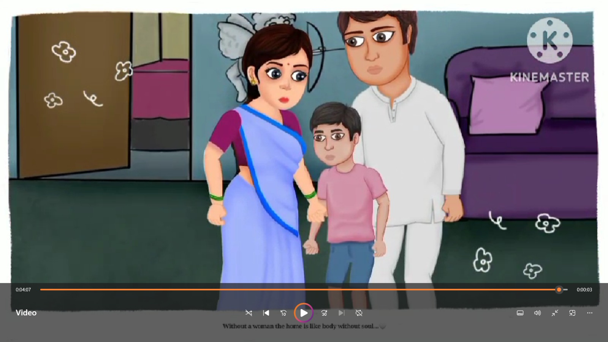
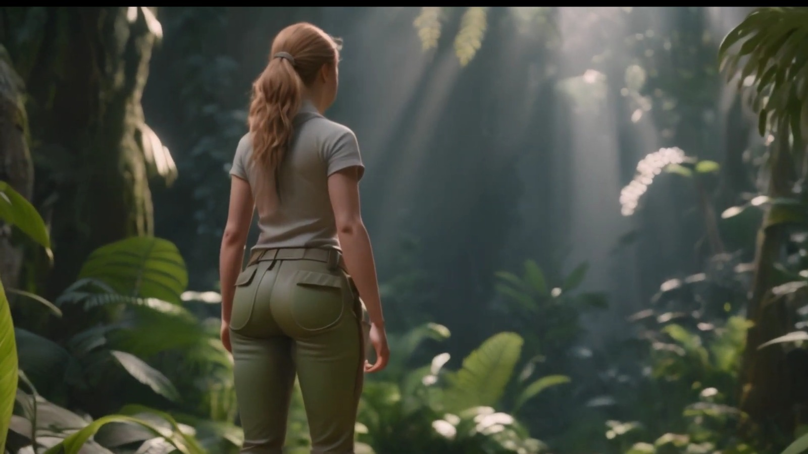

# 🎨 Cartoon Graphics Editing

A creative cartoon storytelling project created during my **Diploma 3rd semester**.  
This project focuses on **cartoon scene design, graphics editing, and visual storytelling** using KineMaster.

The goal of this project was to explore **creative digital media and animated storytelling** while learning how visuals can communicate ideas in a simple and engaging way.

---

## 🎬 Watch the Full Video

▶️ **YouTube Link:**  
[Watch on my Channel](https://youtube.com/@journeyland3?si=1tQWq5XQS6QNmucC)

---

## 🖼️ Project Preview

  

